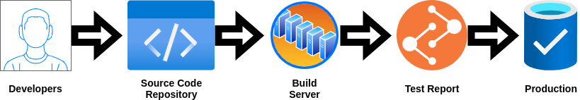

# Devops pada Perusahaan shopee
Shopee belum memiliki Devops dalam pengembangan sistem aplikasi yang telah mereka buat, maka dari itu saya sebagai Devops Engineer akan menerapkan bagaimana manajemen perusahaan dalam merencanakan sebuah project sehingga tim yang dikendalikan dapat bekerja dengan baik :

## Flow DevOps

## Continuous Development

Alat yang digunakan: Git

Git adalah salah satu tipe version control system (VCS) yang memudahkan proses pelacakan dan pencatatan perubahan dari sebuah dokumen. Hal ini memudahkan developers untuk melihat secara detail perubahan yang telah terjadi pada kode aplikasi atau website.

### Alasan menggunakan Git
- Sudah terintegrasi dengan berbagai tools dan service software pihak ketiga.
- Open Source yang memiliki banyak komunitas

## Continuous Integration

Alat yang digunakan: jenkins dan ubuntu

Jenkins merupakan automation server yang bersifat open source serta bebas untuk digunakan. Alat ini dapat membantu mengotomatisasi proses software development dengan continuous integration (CI) dan memfasilitasi aspek teknis untuk continuous delivery (CD). Dengan Jenkins, Anda dapat mengatur dan menyesuaikan CI/CD pipeline sesuai dengan apa yang Anda butuhkan. Jenkins menjadi alat yang populer di kalangan DevOps Engineer karena menawarkan lebih dari 1000 plugin yang dapat terintegrasi dengan hampir semua alat DevOps.

Ubuntu adalah distribusi Linux berdasarkan Debian yang dibuat pada tahun 2004. Ubuntu merupakan operasi sistem yang paling banyak digunakan. Awalnya Ubuntu dikembangkan untuk komputer pribadi, hingga kemudian Ubuntu mulai dikembangkan untuk digunakan pada server, dan smartphone.

### Alasan menggunakan jenkins
- memiliki banyak plugins
- dapat dicustomize sesuai dengan kebutuhan
- memiliki banyak plugins yang dapat mengintegrasi

### Alasan menggunakan ubuntu
- Gratis untuk Digunakan
- Open Sources
- Ringan Digunakan

## Continuous Testing

Alat yang digunakan: Selenium

 Selenium adalah tools auto testing yang digunakan untuk mengotomatisasi tes aplikasi web yang dilakukan pada browser. Selenium akan melakukan validasi web apps pada berbagai browser dan platform.

Dengan alat ini, dapat melakukan proses pengujian berkelanjutan untuk menguji kinerja dan fungsionalitas kode yang dikembangkan.

## Alasan menggunakan Selenium
- tools open source
- Support dengan beberapa bahasa pemrograman dan framework
- Selenium bisa digunakan pada berbagai browser dan sistem operasi

## Continuous Deployment

Alat yang digunakan: Docker

Docker adalah sebuah teknologi container software open source yang memungkinkan Anda untuk membangun, menguji, dan menyebarkan aplikasi terdistribusi dalam lingkungan yang terisolasi. Docker menyediakan virtualisasi ringan dengan overhead hampir nol. Dengan Docker, Elitery dapat mengoptimalkan Infrastruktur TI Perusahaan Anda, dengan menghilangkan guest OS atau Hypervisor serta biaya lisensinya. Anda juga akan dapat Merilis Software lebih cepat, Meningkatkan Produktivitas Pengembang, Memiliki Aplikasi Portable dan Mengurangi jumlah penyimpanan :

- Konfigurasi sederhana
- Dapat Melakukan Pengujian dan Distribusi Aplikasi Secara Terus Menerus
- dapat digunakan dengan berbagai manajemen konfigurasi seperti Chef, Puppet, dan Ansible

## Continuous Monitoring

Alat yang digunakan: Nagios

Nagios merupakan open source monitoring sistem komputer, jaringan pemantauan dan monitoring infrastruktur aplikasi perangkat lunak. Nagios menawarkan pemantauan dan layanan peringatan untuk server, switch, aplikasi, dan layanan. Ia mengingatkan pengguna bila ada sesuatu yang salah dan mengingatkan mereka untuk kedua kalinya ketika masalah telah diselesaikan :

- Kemudahan untuk membuat plugin
- Beragam Pemberitahuan Jika dideteksi adanya trouble
- Pengecekan layanan secara paralel
