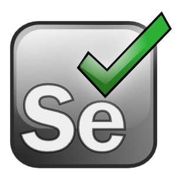

# Devops pada Perusahaan shopee
**Shopee** belum memiliki Devops dalam pengembangan sistem aplikasi yang telah mereka buat, maka dari itu saya sebagai Devops Engineer akan menerapkan bagaimana manajemen perusahaan dalam merencanakan sebuah project sehingga tim yang dikendalikan dapat bekerja dengan baik :

## Flow DevOps

## Continuous Development

Alat yang digunakan: Git

**Git** adalah salah satu tipe _version control system_ (VCS) yang memudahkan proses pelacakan dan pencatatan perubahan dari sebuah dokumen. Hal ini memudahkan developers untuk melihat secara detail perubahan yang telah terjadi pada kode aplikasi atau _website_.

### Alasan menggunakan Git
- Sudah terintegrasi dengan berbagai tools dan _service software_ pihak ketiga.
- _Open Source_ yang memiliki banyak komunitas

## Continuous Integration

Alat yang digunakan: jenkins dan ubuntu

**Jenkins** merupakan _automation server_ yang bersifat _open source_ serta bebas untuk digunakan. Alat ini dapat membantu mengotomatisasi proses _software development_ dengan _continuous integration_ (CI) dan memfasilitasi aspek teknis untuk _continuous delivery_ (CD). Dengan Jenkins, Anda dapat mengatur dan menyesuaikan CI/CD _pipeline_ sesuai dengan apa yang Anda butuhkan. Jenkins menjadi alat yang populer di kalangan _DevOps Engineer_ karena menawarkan lebih dari 1000 plugin yang dapat terintegrasi dengan hampir semua alat DevOps.

### Alasan menggunakan jenkins
- memiliki banyak plugins
- dapat dicustomize sesuai dengan kebutuhan
- memiliki banyak plugins yang dapat mengintegrasi

## Continuous Testing

Alat yang digunakan: Selenium

 **Selenium** adalah tools auto testing yang digunakan untuk mengotomatisasi tes aplikasi web yang dilakukan pada browser. Selenium akan melakukan validasi web apps pada berbagai browser dan platform.

Dengan alat ini, dapat melakukan proses pengujian berkelanjutan untuk menguji kinerja dan fungsionalitas kode yang dikembangkan.

## Alasan menggunakan Selenium
- _tools open source_
- _Support_ dengan beberapa bahasa pemrograman dan _framework_
- Selenium bisa digunakan pada berbagai browser dan sistem operasi

## Continuous Deployment

Alat yang digunakan: Docker

**Docker** adalah sebuah teknologi _container software open source_ yang memungkinkan Anda untuk membangun, menguji, dan menyebarkan aplikasi terdistribusi dalam lingkungan yang terisolasi. Docker menyediakan virtualisasi ringan dengan _overhead_ hampir nol. Dengan Docker, Elitery dapat mengoptimalkan Infrastruktur TI Perusahaan Anda, dengan menghilangkan _guest OS_ atau _Hypervisor_ serta biaya lisensinya. Anda juga akan dapat Merilis _Software_ lebih cepat, Meningkatkan Produktivitas Pengembang, Memiliki Aplikasi Portable dan Mengurangi jumlah penyimpanan :

- Konfigurasi sederhana
- Dapat Melakukan Pengujian dan Distribusi Aplikasi Secara Terus Menerus
- dapat digunakan dengan berbagai manajemen konfigurasi seperti Chef, Puppet, dan Ansible

## Continuous Monitoring

Alat yang digunakan: Nagios

**Nagios** merupakan _open source_ monitoring sistem komputer, jaringan pemantauan dan monitoring infrastruktur aplikasi perangkat lunak. Nagios menawarkan pemantauan dan layanan peringatan untuk _server_, _switch_, aplikasi, dan layanan. Ia mengingatkan pengguna bila ada sesuatu yang salah dan mengingatkan mereka untuk kedua kalinya ketika masalah telah diselesaikan :

- Kemudahan untuk membuat _plugin_
- Beragam Pemberitahuan Jika dideteksi adanya _trouble_
- Pengecekan layanan secara paralel

## Operating System

**Ubuntu** adalah distribusi Linux berdasarkan Debian yang dibuat pada tahun 2004. Ubuntu merupakan operasi sistem yang paling banyak digunakan. Awalnya Ubuntu dikembangkan untuk komputer pribadi, hingga kemudian Ubuntu mulai dikembangkan untuk digunakan pada _server_, dan _smartphone_.

### Alasan menggunakan ubuntu
- Gratis untuk Digunakan
- _Open Sources_
- Ringan Digunakan

### IP

Perusahaan ini menggunakan **LAN** _(Local Area Network)_ karena jaringannya masih mencakup wilayah kecil dengan tipe jaringan _CLient-Server_. memiliki akses yang tinggi, keamanan dan _backup_ data lebih baik. **Topology** yang digunakan adalah **Star**, **IP address** yang digunakan perusahaan ini adalah **IP Address Public** dengan jenis **IP Address Dinamis**.
